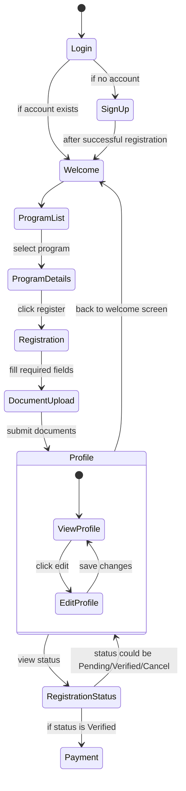
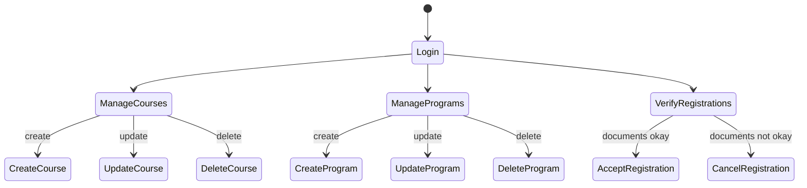

```mermaid
stateDiagram-v2
    [*] --> Login
    Login --> SignUp : if no account
    Login --> Welcome : if account exists
    SignUp --> Welcome : after successful registration
    Welcome --> ProgramList
    ProgramList --> ProgramDetails : select program
    ProgramDetails --> Registration : click register
    Registration --> DocumentUpload : fill required fields
    DocumentUpload --> Profile : submit documents
    Profile --> RegistrationStatus : view status
    RegistrationStatus --> Profile : status could be Pending/Verified/Cancel
    RegistrationStatus --> Payment : if status is Verified
    Profile --> Welcome : back to welcome screen
    
    state Profile {
        [*] --> ViewProfile
        ViewProfile --> EditProfile : click edit
        EditProfile --> ViewProfile : save changes
    }
```

#### Admin State Diagram

```mermaid
stateDiagram-v2
        [*] --> Login
        Login --> ManageCourses
        Login --> ManagePrograms
        Login --> VerifyRegistrations
        ManagePrograms --> CreateProgram : create
        ManagePrograms --> UpdateProgram : update
        ManagePrograms --> DeleteProgram : delete
        ManageCourses --> CreateCourse : create
        ManageCourses --> UpdateCourse : update
        ManageCourses --> DeleteCourse : delete
        VerifyRegistrations --> AcceptRegistration : documents okay
        VerifyRegistrations --> CancelRegistration : documents not okay
    
```