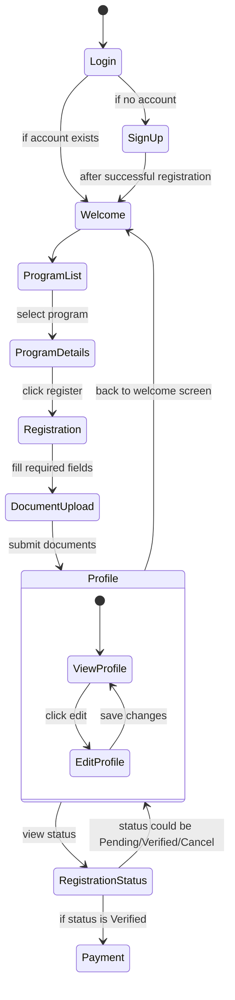
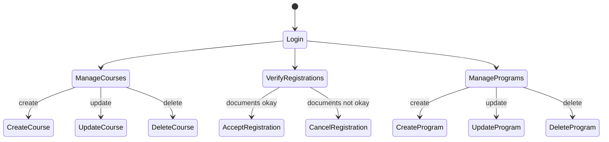
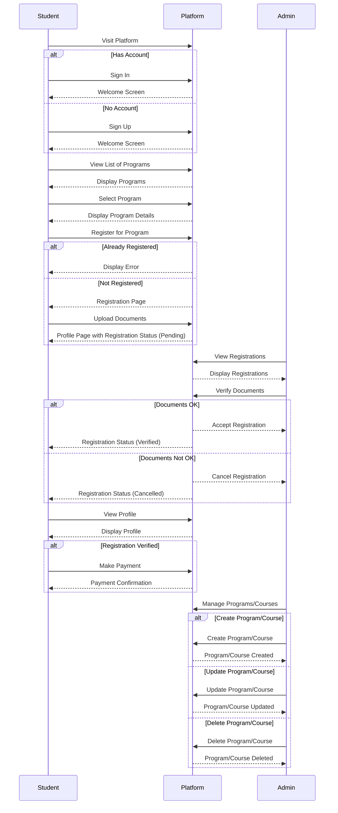

State Transition - Student

```mermaid
stateDiagram-v2
    [*] --> Login
    Login --> SignUp : if no account
    Login --> Welcome : if account exists
    SignUp --> Welcome : after successful registration
    Welcome --> ProgramList
    ProgramList --> ProgramDetails : select program
    ProgramDetails --> Registration : click register
    Registration --> DocumentUpload : fill required fields
    DocumentUpload --> Profile : submit documents
    Profile --> RegistrationStatus : view status
    RegistrationStatus --> Profile : status could be Pending/Verified/Cancel
    RegistrationStatus --> Payment : if status is Verified
    Profile --> Welcome : back to welcome screen
    
    state Profile {
        [*] --> ViewProfile
        ViewProfile --> EditProfile : click edit
        EditProfile --> ViewProfile : save changes
    }
```

## State Transition - Admin

```mermaid
stateDiagram-v2
    [*] --> Login
        Login --> ManageCourses
        Login --> VerifyRegistrations
        Login --> ManagePrograms
        ManagePrograms --> CreateProgram : create
        ManagePrograms --> UpdateProgram : update
        ManagePrograms --> DeleteProgram : delete
        ManageCourses --> CreateCourse : create
        ManageCourses --> UpdateCourse : update
        ManageCourses --> DeleteCourse : delete
        VerifyRegistrations --> AcceptRegistration : documents okay
        VerifyRegistrations --> CancelRegistration : documents not okay
```

## Sequence Diagram 

```mermaid
sequenceDiagram
    participant Student
    participant Platform
    participant Admin

    Student ->> Platform: Visit Platform
    alt Has Account
        Student ->> Platform: Sign In
        Platform -->> Student: Welcome Screen
    else No Account
        Student ->> Platform: Sign Up
        Platform -->> Student: Welcome Screen
    end

    Student ->> Platform: View List of Programs
    Platform -->> Student: Display Programs

    Student ->> Platform: Select Program
    Platform -->> Student: Display Program Details

    Student ->> Platform: Register for Program
    alt Already Registered
        Platform -->> Student: Display Error
    else Not Registered
        Platform -->> Student: Registration Page
        Student ->> Platform: Upload Documents
        Platform -->> Student: Profile Page with Registration Status (Pending)
    end

    Admin ->> Platform: View Registrations
    Platform -->> Admin: Display Registrations

    Admin ->> Platform: Verify Documents
    alt Documents OK
        Platform -->> Admin: Accept Registration
        Platform -->> Student: Registration Status (Verified)
    else Documents Not OK
        Platform -->> Admin: Cancel Registration
        Platform -->> Student: Registration Status (Cancelled)
    end

    Student ->> Platform: View Profile
    Platform -->> Student: Display Profile

    alt Registration Verified
        Student ->> Platform: Make Payment
        Platform -->> Student: Payment Confirmation
    end

    Admin ->> Platform: Manage Programs/Courses
    alt Create Program/Course
        Admin ->> Platform: Create Program/Course
        Platform -->> Admin: Program/Course Created
    else Update Program/Course
        Admin ->> Platform: Update Program/Course
        Platform -->> Admin: Program/Course Updated
    else Delete Program/Course
        Admin ->> Platform: Delete Program/Course
        Platform -->> Admin: Program/Course Deleted
    end

```